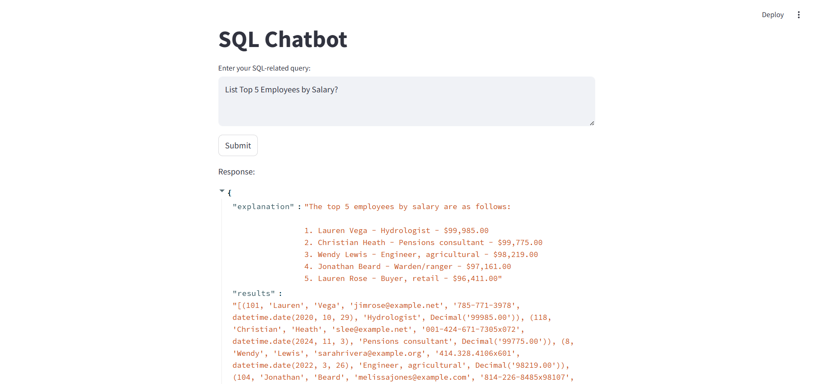

# SalesOrder SQL Chatbot


## Overview
A minimal AI chatbot that translates natural language into SQL queries, queries a MySQL database, and displays the results—all via a user-friendly Streamlit interface.



This project is a minimal Text2SQL application built using LangChain, designed to convert natural language queries into executable SQL commands. It connects to a MySQL database and provides a user-friendly web interface using Streamlit. The chatbot interprets user queries like "List Top 5 Employees by Salary?" and returns structured responses, both as natural-language explanations and raw SQL result data.

🔧 Core Technologies
* LangChain: Used to manage the prompt engineering, chaining logic, and interaction with the LLM.

* MySQL: Hosts the structured database, which includes employee records and related information.

* Streamlit: Provides a responsive and intuitive front-end for real-time query input and response display.

🧠 Prompt Engineering Techniques
The success of the SQL generation relies heavily on a carefully crafted prompting strategy:

* Few-Shot Prompting:
The prompt includes several hand-picked examples of natural language questions and their corresponding SQL translations.
These examples demonstrate the expected structure, column naming conventions, and logic patterns needed for the LLM to generalize correctly.

* Few-Shot Example Selector:
To avoid overwhelming the model and reduce token usage, a dynamic example selector retrieves only the most relevant few-shot examples for a given input query.
This helps maintain accuracy while keeping the prompt efficient.

* Database Schema Injection:
The full database schema (table names, column names, and types) is explicitly included in the prompt.
This gives the model grounding in the actual structure of the underlying database, reducing hallucination and increasing SQL accuracy.

* Prompt Templates with LangChain:
Prompt composition is modular, combining instructions, schema, few-shot examples, and the user question in a consistent format.
This enables reusability and debugging of specific prompt components.

## 🚀 Setup & Run

### Clone the repository
```bash
git clone https://github.com/edcalderin/Salesorder_SQLChatbot.git
cd Salesorder_SQlChatbot
```

### Development workflow
1. Copy `.env.example` to `.env` and update the OPENAI_API_KEY  :

    ```   
    OPENAI_API_KEY=your-api-key-here
    ```

2. Start services:

    ```bash
    docker-compose up --build
    ```

3. Populate the database:

    ```bash
    python -m mysql_ingestion.initialize_data
    ```

4. Go to:

```bash
http://localhost:8501/
```

### Lint
Style the code with Ruff:

```bash
ruff format .
ruff check . --fix
```
### Remove the containers

```bash
docker-compose down
```

## Contact
**LinkedIn:** https://www.linkedin.com/in/erick-calderin-5bb6963b/  
**e-mail:** edcm.erick@gmail.com

## Enjoyed this content?
Explore more of my work on [Medium](https://medium.com/@erickcalderin) 

I regularly share insights, tutorials, and reflections on tech, AI, and more. Your feedback and thoughts are always welcome!
